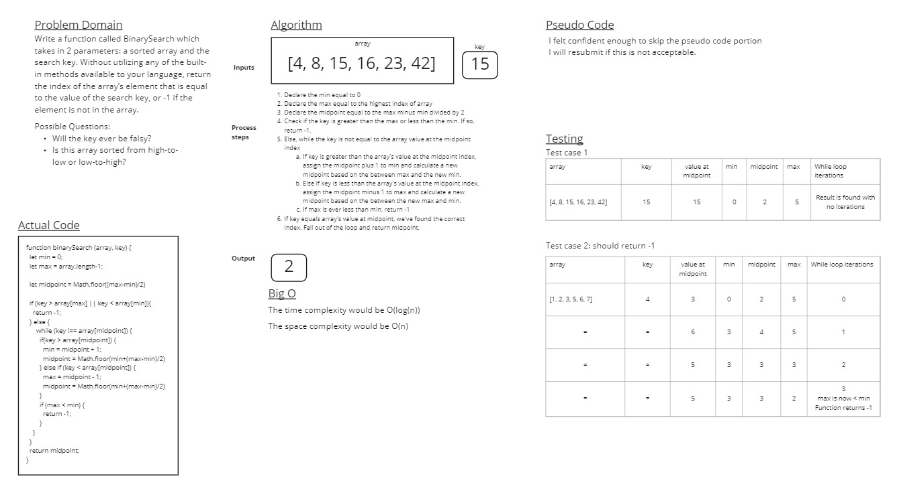

# Binary Search of Sorted Array

The goal for this challenge was to write a function called BinarySearch which takes in 2 parameters: a sorted array and the search key. The function should return the index of the array’s element that is equal to the value of the search key, or -1 if the element is not in the array. As with other code challenges, built-in features of JavaScript are not permissible.

## Whiteboard Process

## Approach & Efficiency
<!-- What approach did you take? Discuss Why. What is the Big O space/time for this approach? -->
My approach for this code challenge was simply to figure out the best way to check and then narrow down a "search range" of index values. This took several revisions before I was happy with it. I then looked at other approaches and incorporated ideas from them (specifically re-assigning max and min but adjusted by 1.
