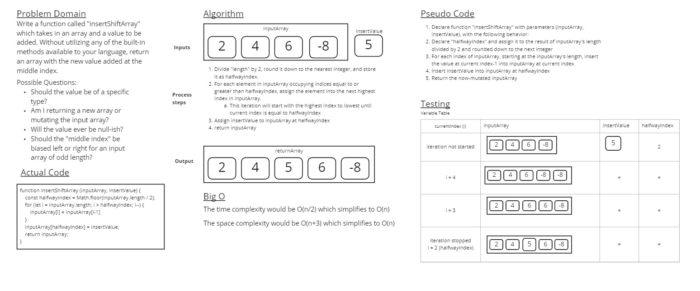

# Insert and Shift an Array

The goal for this Code Challenge was to write a function called insertShiftArray which takes in an array and a value to be added. Without utilizing any of the built-in methods available to JavaScript, it will return an array with the new value added at the middle index.

## Whiteboard Process

## Approach & Efficiency
<!-- What approach did you take? Discuss Why. What is the Big O space/time for this approach? -->
My approach for this Code Challenge was to come up with a short solution which relied on deduction to perform it's task in minimal lines of code, and did so without creating a new array. My for loop steps through the array from highest index to lowest to basically create room for the insert value one index at a time, until it's reached the halfway index. Then the insert value could and would be inserted. Regardless of it's efficiency, this iterative process of "making space" is algorithmically simple and would be easy to debug.

I made a minor attempt to find the big O space and time complexity. I know it's not required until we are formally introduced to that material later.
