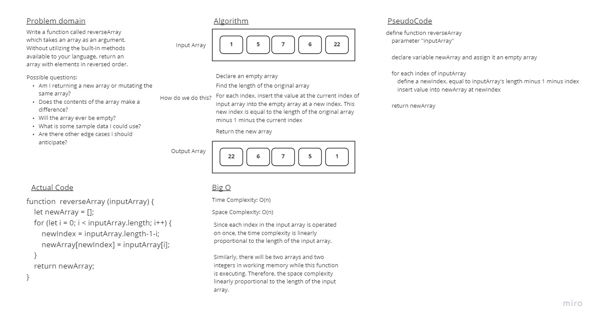

# Reverse an Array

The task for this code challenge is to write a function called reverseArray which takes an array as an argument. Without utilizing any of the built-in methods available to your language, return an array with elements in reversed order.

## Whiteboard Process

## Approach & Efficiency
<!-- What approach did you take? Discuss Why. What is the Big O space/time for this approach? -->
My approach was to make a robust, simple solution with no caveats or tricks. I did this because it's my first whiteboarding experience. I wanted to focus on learning the basic whiteboarding skillset without complicating the process by trying to make a clever algorithm. I already had to google search Big O to find out how my algorithm can be measured by those metrics.

Both Big-O space and time are O(n). I've explained those determinations in my whiteboard.
