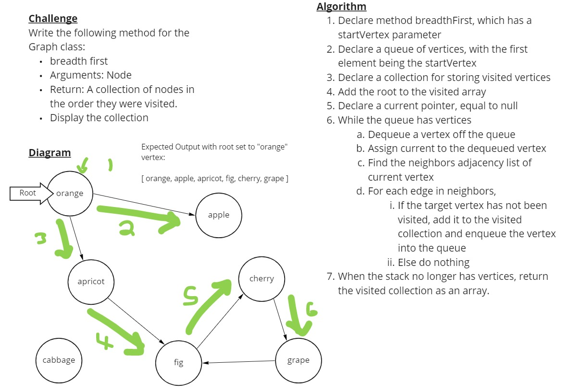

# Breadth-First Traversal of a Graph

Implement a breadth-first traversal on a graph.

## Challenge

Write the following method for the Graph class:

- `breadthFirst`
  - Arguments: vertex
  - Return: A collection of vertices in the order they were visited.

## Approach and Efficiency

The solution I implemented is based mostly on what we were shown during the Graphs lecture. I did use my own Queue class for queueing up vertices to be traversed.

The time and space complexity are both O(n).

## Solution

