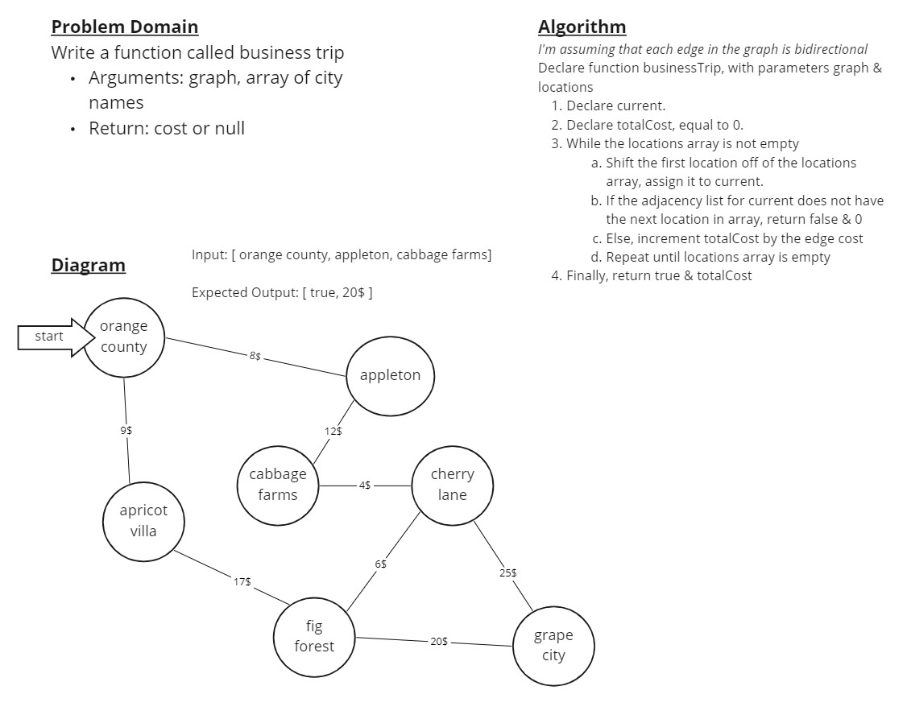

# Find Edges

Given a business trip itinerary, and an Alaska Airlines route map, is the trip possible with direct flights? If so, how much will the total trip cost be?

## Challenge

- Write a function called business trip
  - Arguments: graph, array of city names
  - Return: cost or `null`

## Approach & Efficiency

My approach for this was essentially to iterate through the locations array while removing vertices off of it, and then iterate through the neighbors of the shifted vertices to see if there was a direct connection. The trickiest part was realizing I needed to break the "neighbor search" for loop if a direct connection was found, otherwise it would hit the end of the neighbors list and return false as if it didn't find the connection.

The solution's time & space complexity are O(n) & O(1) respectively.

## Solution

