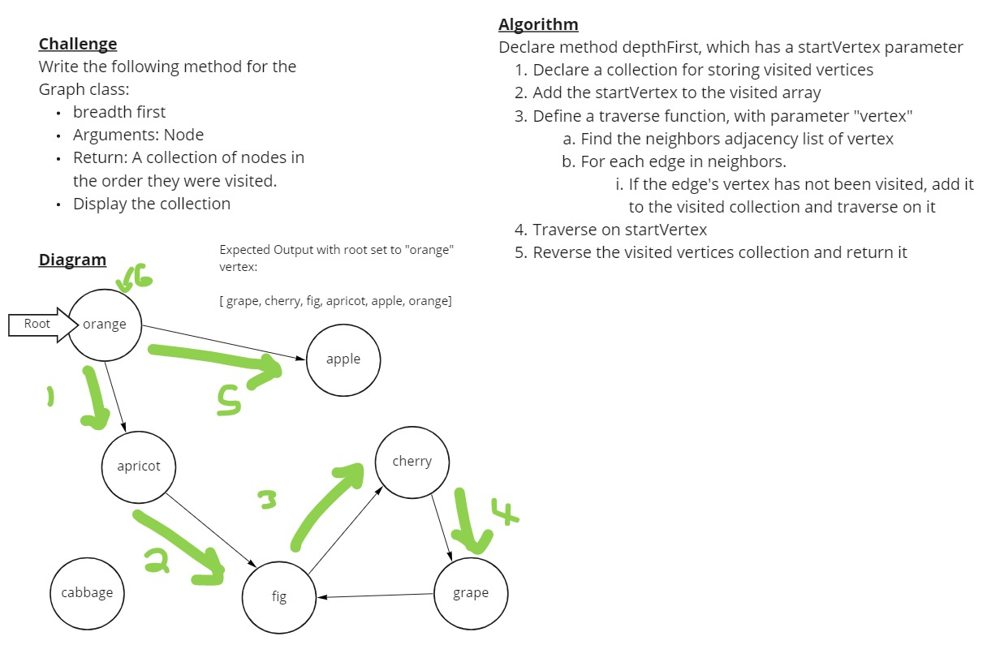

# Depth First Traversal

Create a method which performs a depth first traversal on a graph, returning the furthest vertices first.

## Challenge

Write the following method for the Graph class:

- Name: Depth first
- Arguments: Node (Starting point of search)
- Return: A collection of nodes in their pre-order depth-first traversal order
- Program output: Display the collection

## Approach & Efficiency

My approach was first to try to use similar logic to the breadth first traversal, except use a stack instead of a queue. That didn't work out, so I pivoted to make a recursive function with which to traverse.

The time and space complexity are O(n) and O(n) respectively.

## Solution

