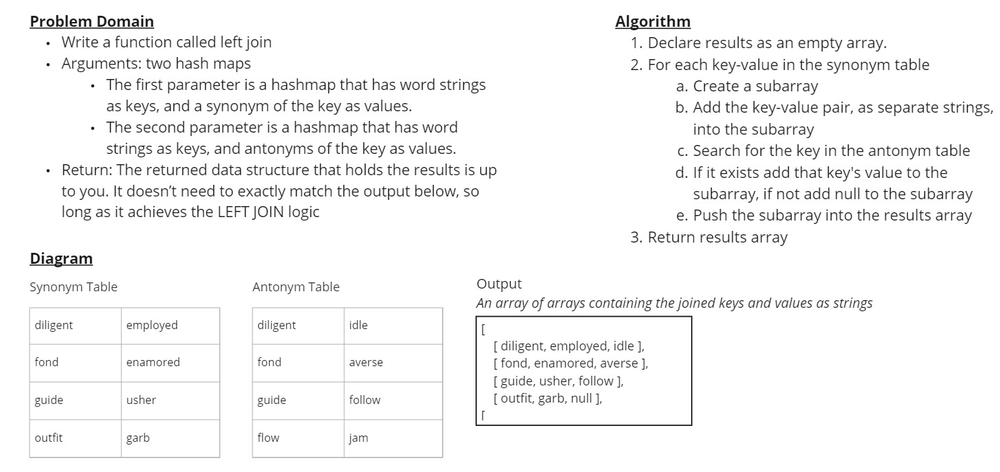

# Hashmap LEFT JOIN

The goal for the code challenge was to implement a simplified LEFT JOIN for 2 Hashmaps.

## Challenge

Write a function called left join

- Arguments: two hash maps
  - The first parameter is a hashmap that has word strings as keys, and a synonym of the key as values.
  - The second parameter is a hashmap that has word strings as keys, and antonyms of the key as values.
- Return: The returned data structure that holds the results is up to you. It doesn’t need to exactly match the output below, so long as it achieves the LEFT JOIN logic

## Approach & Efficiency

I take best to iterative approaches, and that did not change for this Code Challenge. I created a variant of `HashTable.keys()`, called `callingAllKeys()`, which calls a callback on all keys in the hashtable. The callback would itself call `antonymTable.get(key)` using the object key from the synonym hashtable, process that into null if it was falsy, then push the results into a subarray.

The time and space efficiency are hard to gauge for my solution. The built-in array methods `.push()` and `.filter()` are used, and I do not know their specs.

That said, a safe assumption is that the average time complexity is O(n) and the space complexity is O(1). Like with other hashtable algorithms, I believe the time complexity will degrade to O(n^2) if all key-value pairs end up in the same bucket in both tables.

## Solution

