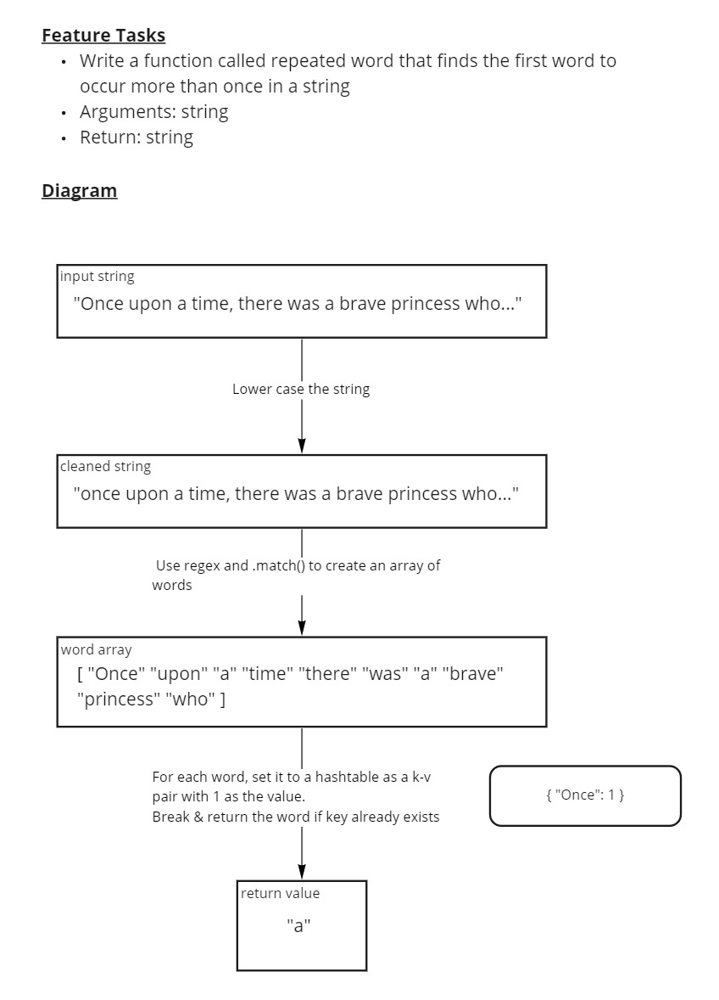

# Repeated Word finder

Find the first repeated word in a book.

- Write a function called repeated word that finds the first word to occur more than once in a string
  - Arguments: string
  - Return: string

## Whiteboard



## Approach & Efficiency

I knew from the start I wanted to use regex for this code challenge. Unfortunately this makes the time and space efficiency of the resulting algorithm a matter of prediction as I'm not privy to the performance of JavaScript's regex engine.

Assuming the regex engine is O(n) in both time and space complexity, my algorithm would be O(n) for time and space complexity as well.

## Solution

```js

// Returns "a" from the beginning of a fairy tale
let result = repeatedWord('Once upon a time, there was a brave princess who...');

console.log(result) // Prints 'a'

// Returns "it" from the first paragraph of A Tale of Two Cities
let excerpt = 'It was the best of times, it was the worst of times, it was the age of wisdom, it was the age of foolishness, it was the epoch of belief, it was the epoch of incredulity, it was the season of Light, it was the season of Darkness, it was the spring of hope, it was the winter of despair, we had everything before us, we had nothing before us, we were all going direct to Heaven, we were all going direct the other way – in short, the period was so far like the present period, that some of its noisiest authorities insisted on its being received, for good or for evil, in the superlative degree of comparison only...';
result = repeatedWord(excerpt);

console.log(result) // Prints 'it'

// Returns "summer" from the start of The Bell Jar
result = repeatedWord('It was a queer, sultry summer, the summer they electrocuted the Rosenbergs, and I didn’t know what I was doing in New York...');

console.log(result) // Prints 'summer'
```
