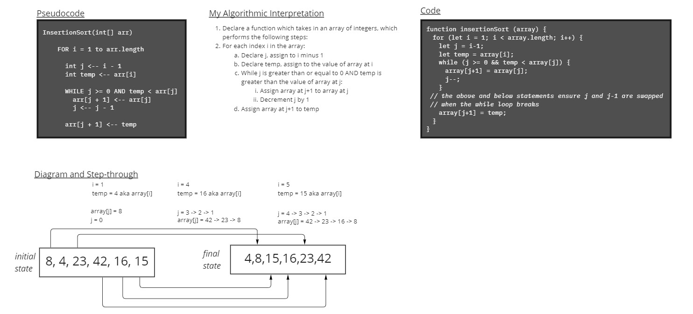

# Insertion Sort

The following pseudocode function `InsertionSort` sorts an array of integers, in place, from smallest to largest.

```md
InsertionSort(int[] arr)

  FOR i = 1 to arr.length

    int j <-- i - 1
    int temp <-- arr[i]

    WHILE j >= 0 AND temp < arr[j]
      arr[j + 1] <-- arr[j]
      j <-- j - 1

    arr[j + 1] <-- temp
```

## How does it work?

Let's walk it through with this test array `[2, 51, 9]`

First we started a `for` loop which will iterate through the entire array. Since the function uses `i` and `j` to compare pairs of adjacent indices, it's necessary to start iterating at index 1 instead of index 0.

In each iteration of the for loop, `j` is assigned `i-1`.

## Analysis Whiteboard


