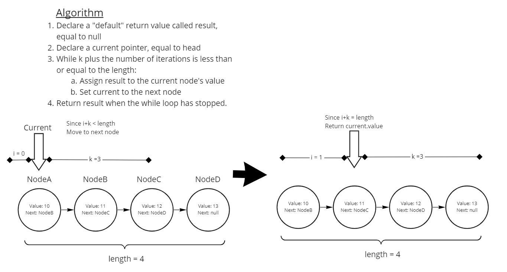

# Challenge Summary

In this challenge, the goal was to create a method `kthFromEnd` which would return a specific value stored in a linked list. This value would be from the `k`th node from the `tail` of the linked list.

## Whiteboard Process



## Approach & Efficiency

My approach for this was pretty haphazard. Overall, I was more focused on trying to implement interesting code, not necessarily solving the problem at hand.

I say this because I started by creating a function `reverse` to reverse a linked list. This took a long time, and it didn't even end up in my `kthFromEnd` method.

By the time I started work on `kthFromEnd`, I decided to use an solution which seemed straightforward. The current pointer would partially traverse the linked list. It would know to stop by comparing the "length" of `k`, plus the number of iterations, to the length of the linked list.

## Solution

```js
  let testLL = new LinkedList;
  let value1 = 12;
  let value2 = 13;
  let value3 = 14;
  testLL.append(value1); // Append a single node to the LL

  console.log(testLL.length) // returns 1;

  console.log(
    testLL.kthFromEnd(1) // Returns value in the first and only node: 12
  )

  testLL.append(value2); // Append some more nodes.
  testLL.append(value3);

  console.log(testLL.length) // returns 3;


  console.log(
    testLL.kthFromEnd(4), // Since k is greater than LL length, returns null
    testLL.kthFromEnd(-3), // Since k is negative, returns null
    testLL.kthFromEnd(3) // Since k === length, returns the value in the head node: 12
    testLL.kthFromEnd(2) // Since k is less than LL length, returns the value in node 2: 13
    )

```
