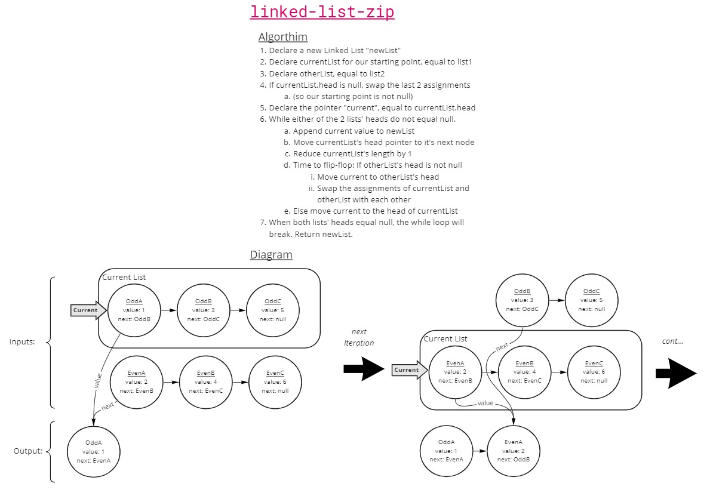

# Challenge Summary

Write a function called `zipLists`, which has 2 parameters `list1` and `list2`. This function will take in 2 linked lists via the parameters and return a new linked list. The new list's nodes should be an interlacing of the input list's. `list1.head -> list2.head -> list1.head.next -> list2.head.next -> etc`.

## Whiteboard Process



## Approach & Efficiency

My approach was to find a good enough solution and then revise it to simplify. My first version of this algorithm did not have "currentList" or "otherList", was easy enough to write out, but the code was not DRY and it was difficult to handle edge cases. But, it helped me wrap my head around the problem. Once I felt good with that solution, I revised it to something shorter and added more edge-case handling.

## Solution

```
