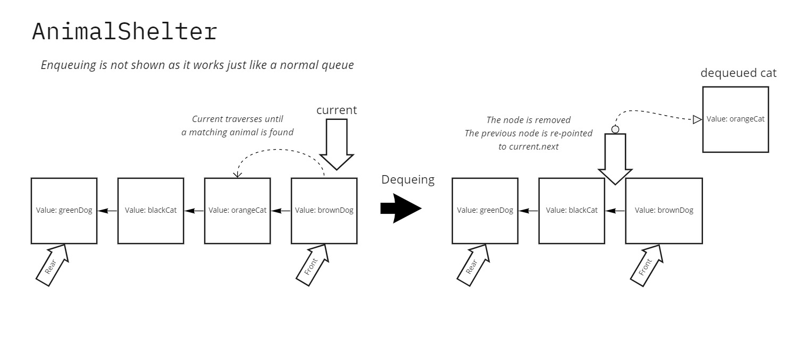

# Challenge Summary

Create a new class called `AnimalShelter`, with methods `enqueue()` and `dequeue()`:

- `enqueue()` takes in a dog or a cat object and adds it to the queue.
- `dequeue()` takes in a `pref` of either `'cat'` or `'dog'` and returns the front-most animal based on the `pref`.

## Whiteboard Process



## Approach & Efficiency

My approach was to reuse the simple-but-effective logic from my previous implementation of a Queue class. As for dequeuing the correct species of animal, I implemented a simple conditional traversal. It's just enough to find the right node, remove it cleanly from the chain, and return it.

The Big O time efficiency for `dequeue()` is O(n) in the worst case, *n* being the full length of the `AnimalShelter`. The remaining efficiency metrics, `dequeue()` space, `enqueue()` space & time, are O(1).

## Solution

```javascript
let myShelter = new AnimalShelter;

// Can queue and dequeue a single animal
let animal1 = { name: 'Buster', species: 'dog' };
myShelter.enqueue(animal1);

console.log(myShelter.dequeue('dog')) // Prints { name: 'Buster', species: 'dog' }

// Can queue and dequeue several animals
let animal2 = { name: 'Okayu', species: 'cat' };
let animal3 = { name: 'Korone', species: 'dog' };
myAnimalShelter.enqueue(animal1);
myAnimalShelter.enqueue(animal2);
myAnimalShelter.enqueue(animal3);

console.log(myShelter.dequeue('dog')) // Prints { name: 'Buster', species: 'dog' }
console.log(myShelter.dequeue('dog')) // Prints { name: 'Korone', species: 'dog' }, even though it's behind a cat 

console.log(myShelter.dequeue('fish')) // Prints null as 'fish' is an invalid pref

console.log(myShelter.dequeue('cat')) // Prints { name: 'Okayu', species: 'cat' }

myShelter.dequeue() // Throws an unhandled error because myShelter is empty.
```
