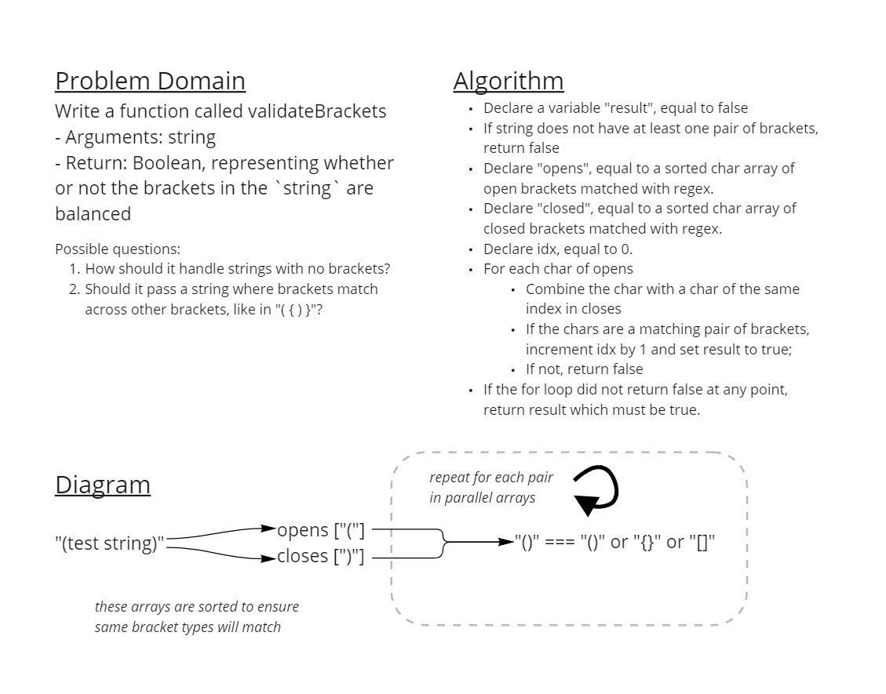

# Challenge Summary

Write a function called `validateBrackets`

- Arguments: `string`
- Return: `Boolean`, representing whether or not the brackets in the `string` are balanced

## Whiteboard Process



## Approach & Efficiency

For this challenge I started off knowing I wanted to use regex. While regex is a black-box performance-wise, it makes sorting out the brackets from a given string much easier in terms of lines written. I ended up using regex to create two sorted arrays of open brackets and close brackets. I then combined each pair across the parallel arrays and saw if they equated to a matching pair of brackets.

The Big O space efficiency is O(n), and the Big O time efficiency is unknown.

## Solution

```javascript
// Passes best-case scenarios
console.log(validateBrackets('{}')) // Prints true
console.log(validateBrackets('[]')) // Prints true
console.log(validateBrackets('()')) // Prints true

// Passes nested brackets of different types
console.log(validateBrackets('([{}])')) // Prints true

// Passes text with each type of bracket
console.log(validateBrackets('(das)[{adsghlaskdj}asfd1243]')) // Prints true

// Fails string with no brackets
console.log(validateBrackets('no brackets?')) // Prints false

// 'Fails string with only one bracket
console.log(validateBrackets('one bracket!)')) // Prints false

// Fails string with only two brackets of different types
console.log(validateBrackets('(}')) // Prints false
```
