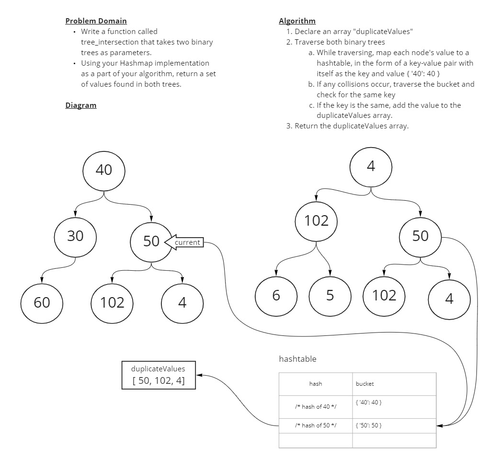

# Tree Intersection

Find common values in 2 binary trees.

## Whiteboard Process



## Approach & Efficiency

I extensively used the logic from previous Code Challenges. I knew that I had solved the problem before of traversing a binary tree (`tree.preOrder()`), and that I solved the problem of detecting duplicate values in a hashtable (`hashtable.setOrGet()`). With a bit of tweaking I combined the two to solve the challenge. I retooled a pre-order traversal so that instead of printing a list of values, it would execute a callback on the trees' values. That callback push the return from the `setOrGet()` method which returns an existing key's value if it already exists in the hashtable (returns `undefined` if it does not exist).

My solution is O(n) for both time and space complexity. O(n) for time because it fully traverses both trees, and O(n) for space because the recursive traverse function adds to the callstack for each trees' nodes. If every value somehow ends up in the same bucket, the time complexity will degrade to O(n^2).

## Solution

```js
let tree1 = new Tree();
let tree2 = new Tree();

// Returns correct output with one-node trees
tree1.root = new Node(10);
tree2.root = new Node(10);

let result = treeIntersection(tree1, tree2);
console.log(result); // Prints [10]

// Returns correct output with 3-node trees
tree1.root.right = new Node(30);
tree1.root.left = new Node(6);
tree2.root.right = new Node(40);
tree2.root.left = new Node(6);

result = treeIntersection(tree1, tree2);
console.log(result); // Prints [10, 6]

// Returns correct output with trees of different sizes
tree1.root.right.right = new Node(40);
tree1.root.right.left = new Node(10214);

result = treeIntersection(tree1, tree2);
console.log(result); // Prints [10, 6, 40]
```
