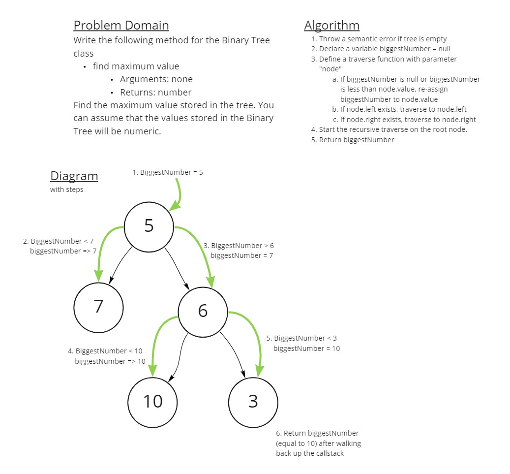

# Challenge Summary

Write a function which finds the maximum value in a Binary Tree which only contains numbers

- Arguments: none
- Return: `Number`, which is the max value in the tree,

## Whiteboard Process



## Approach & Efficiency

I started off the challenge accidentally creating a method for the Binary Search Tree class. This was not a complete waste, though, as I still learned something from the effort.

When I got to making the correct method on the correct class, I realized that an unsorted Binary Tree has no rhyme or reason dictating where values exists. Therefore, my `.findMaxValue()` method had to traverse the entire array to be sure that it checked everything. My solution has a temporary variable which stores the highest number found while a recursive pre-order-esque traversal occurs.

The time and space efficiencies of the method are O(n) and O(1) respectively. As I mentioned above, this is an unsorted binary tree, so I don't think there's any solution faster than O(n).

## Solution

```javascript
let testTree = new Tree();

// Can find the single value in a single-node tree
testTree.root = new Node(5);

console.log(testTree.findMaxValue()) // Prints 5

// Can find the max value in a small tree
testTree.root.right = new Node(4);
testTree.root.left = new Node(6);
testTree.root.right.right = new Node(10);

console.log(testTree.findMaxValue()); // Prints 10

// Can find a new max value after adding a new value
testTree.root.left.right = new Node(15)

console.log(testTree.findMaxValue()); // Prints 15

// Find the same max value if new number is lower than max
testTree.root.left.right.left = new Node(3);

console.log(testTree.findMaxValue()); // Prints 15
```
