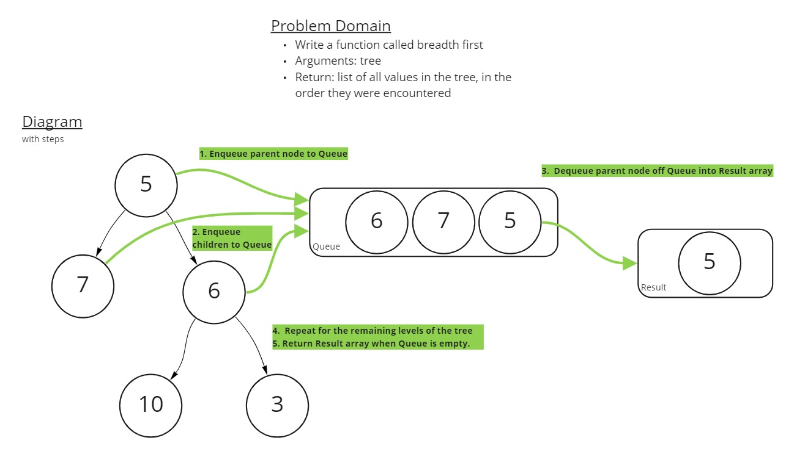

# Challenge Summary

Write a function called breadth first, which traverses a tree in a breadth-first order.

- Arguments: tree
- Return: list of all values in the tree, in the order they were encountered

## Whiteboard Process



## Approach & Efficiency

For this Code Challenge, I used breadthFirst traversal algorithm presented during the "Trees" lecture as a starting point. I gave a lot of thought to if it could be improved, or if a recursive approach might be better, but I could not think of a good reason to change it that significantly.

An iterative approach using a Queue perfectly fits this task. Iteration works well because we're reading nodes per level of the tree. Recursive traversal does not seem well-suited to combining data from separate sub-trees. A Queue works well because we need to read the values in a FIFO-esque order.

The Big O time and space efficiencies are O(n) and O(1) respectively.

## Solution

```javascript
let testTree = new Tree();

// Returns the single node of a one-node tree
testTree.root = new Node(49);

console.log(breadthFirst(testTree)); // Prints [49]

// Returns the nodes of a 2-level tree
testTree.root.right = new Node(64);
testTree.root.left = new Node(36);

console.log(breadthFirst(testTree)); // Prints [49,36,64]

// Returns the nodes of a 3-level tree
testTree.root.right.right = new Node(81);
testTree.root.right.left = new Node(25);

console.log(breadthFirst(testTree)); // Prints [49,36,64,25,81]

// Returns the nodes of a 4-level tree
testTree.root.right.right.left = new Node(100);

console.log(breadthFirst(testTree)); // Prints [49,36,64,25,81,100]
```
