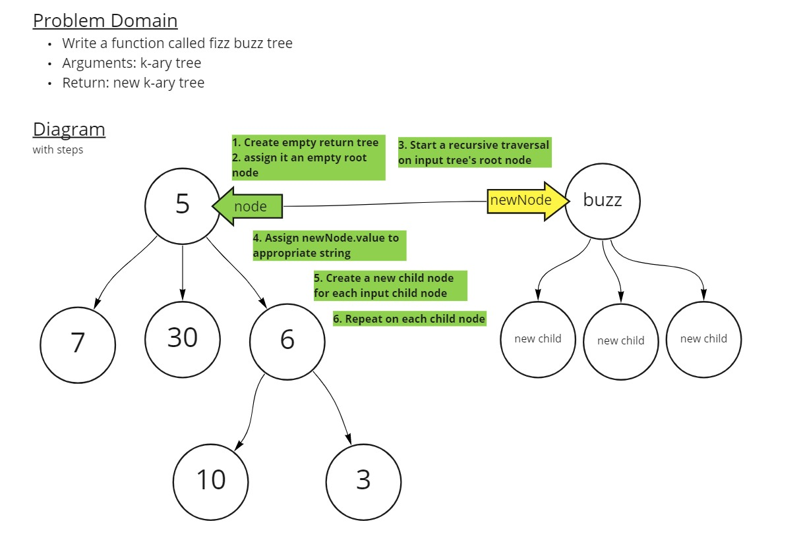

# Challenge Summary

Conduct “FizzBuzz” on a k-ary tree while traversing through it to create a new tree.

Set the values of each of the new nodes depending on the corresponding node value in the source tree.

## Whiteboard Process



## Approach & Efficiency

For this Code Challenge, my starting point was recursive logic similar to a depth-first preOrder traversal. Except, I'd invoke the recursive function with both an input node and a new tree's node as the arguments. The idea was to move parallel pointers across input tree and result tree, building the new tree as I read from the other.

The Big O time and space efficiencies are O(n) and O(1). There's not much getting around an O(n) time efficiency when the input is an unsorted tree.

## Solution

```javascript
let testKTree = new KaryTree();
testKTree.root = new KaryNode(6);

// FizzBuzz a KaryTree with one node
let newKTree = fizzBuzzTree(testKTree);

console.log(newKTree.root.value); // Prints 'Fizz'

// FizzBuzz a KaryTree with one node with 3 children
testKTree.root.children = [
  new KaryNode(12),
  new KaryNode(18),
  new KaryNode(24)
];

newKTree = fizzBuzzTree(testKTree);

console.log(newKTree.root.children[0].value); // Prints 'Fizz'
console.log(newKTree.root.children[1].value); // Prints 'Fizz'
console.log(newKTree.root.children[2].value); // Prints 'Fizz'

// FizzBuzz a 3-level KaryTree

testKTree.root.children[0].children = [
  new KaryNode(30),
  new KaryNode(1)
];

newKTree = fizzBuzzTree(testKTree);

console.log(
  newKTree.root.children[0].children[0].value // Prints 'FizzBuzz'
);
console.log(
  newKTree.root.children[0].children[1].value // Prints '1'
); 
```
